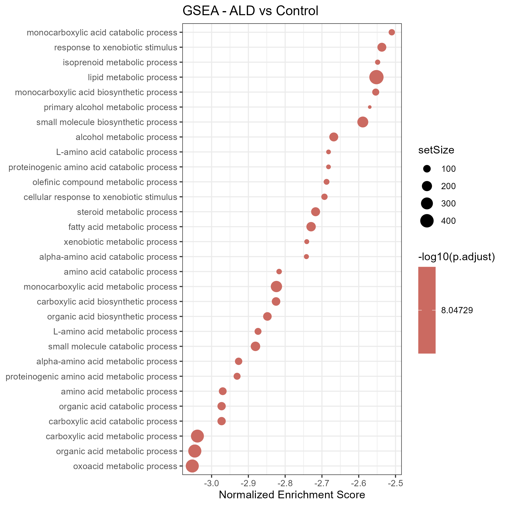

## Key findings (draft)
Add bullet points as you go.

## Figures
Add figures as you generate them. Example:

## Initial GSEA Plot
{fig-cap="GSEA results showing metabolic pathway enrichment."}

## dotplot
{fig-cap="dotplot results comparing cell types with average gene expression of common markers."}

## UMAP
{fig-cap="UMAP comparing cell clusters"}

## Rolodex of Cell type GSEA (individual)

## Interactive GSEA by Cell Type

To avoid stacking all cell-type-specific pathway enrichment plots vertically, this section provides an interactive viewer for comparing GSEA results across annotated liver cell populations. Use the dropdown menu or the previous/next buttons to browse enrichment patterns for each cell type.

  <label for="gseaSelect"><strong>Select GSEA plot:</strong></label>
  <select id="gseaSelect" onchange="updateGSEA()" style="margin-left: 8px; padding: 4px;">
    <option value="figures/GSEA_global_v1.png" selected>Global ALD vs Control</option>
    <option value="figures/GSEA_Test_B_Cells.png">B Cells</option>
    <option value="figures/GSEA_Test_CDCs.png">cDCs</option>
    <option value="figures/GSEA_Test_cholangiocytes.png">Cholangiocytes</option>
    <option value="figures/GSEA_Test_Endothelial_Cells.png">Endothelial Cells</option>
    <option value="figures/GSEA_Test_Hepatocytes.png">Hepatocytes</option>
    <option value="figures/GSEA_hepatocytes.png">Hepatocytes Variant 1</option>
    <option value="figures/GSEA_hepatocytes_v1.png">Hepatocytes Variant 2</option>
    <option value="figures/GSEA_hepatocytes_v2.png">Hepatocytes Variant 3</option>
    <option value="figures/GSEA_hepatocytes_v2.1.png">Hepatocytes Variant 4</option>
    <option value="figures/GSEA_Test_Kupffer_Cells.png">Kupffer Cells</option>
    <option value="figures/GSEA_Test_Monocytes.png">Monocytes</option>
    <option value="figures/GSEA_Test_NK_Cells.png">NK Cells</option>
    <option value="figures/GSEA_Test_Stellate_Cells.png">Stellate Cells</option>
    <option value="figures/GSEA_Test_T_Cells.png">T Cells</option>
    <option value="figures/GSEA_T_Cells.png">T Cells Variant 1</option>
    <option value="figures/GSEA_T_Cells_v1.png">T Cells Variant 2</option>
  </select>

  <button onclick="prevGSEA()" style="margin-left: 10px;">Previous</button>
  <button onclick="nextGSEA()">Next</button>

  

    Global gene set enrichment analysis comparing ALD and control samples across the integrated dataset.
  

  

